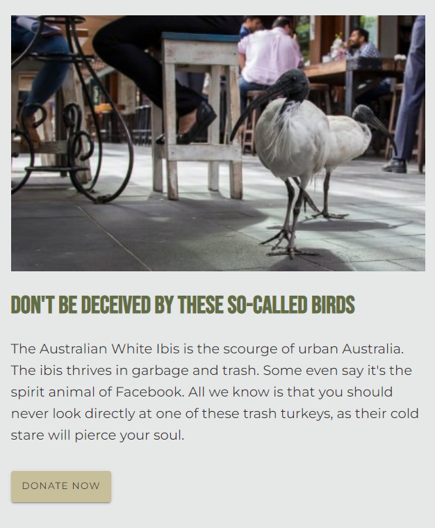
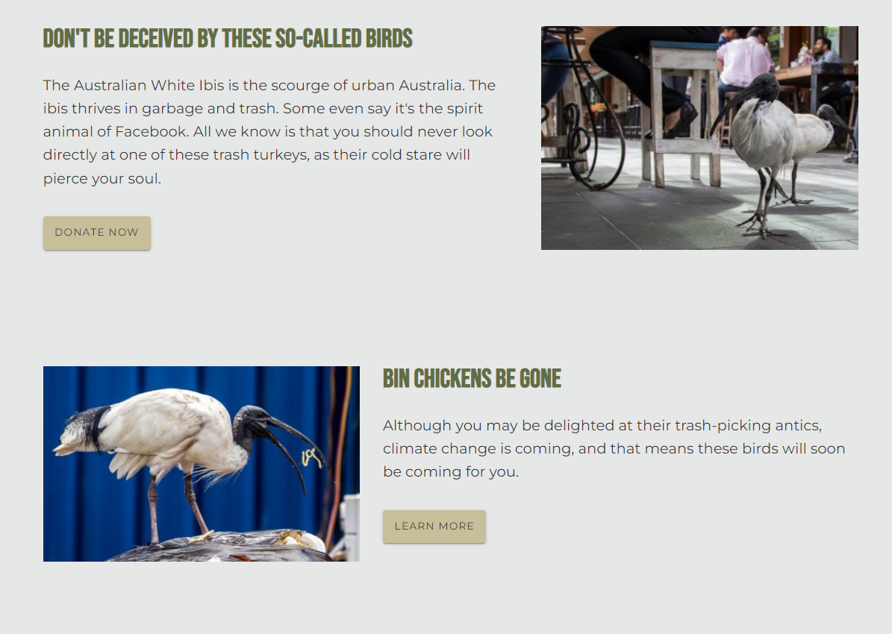
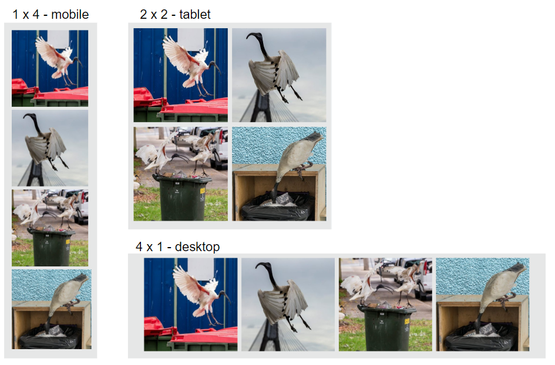

<!-- cSpell:enable  -->

# Responsive flexboxes

**Objectives**: Learn how to use flexbox and media queries to create responsive layouts.

**Concepts covered**: Flexbox, flex property, determining breakpoints, media queries, responsive design using the _mobile-first_ design strategy.

In this assignment you will add flexboxes to your `<body>` element, hero overlay, menu, articles, and cards using mobile-first design and media queries.

| ⚠️  This assignment builds on your _Overlays and cards_ assignment                                                                                                                                                                                                                                                                                                                                                                               |
| :----------------------------------------------------------------------------------------------------------------------------------------------------------------------------------------------------------------------------------------------------------------------------------------------------------------------------------------------------------------------------------------------------------------------------------------------------- |
| After cloning this repo and opening it in VSCode, copy the following files and folders from your _Overlays and cards_ assignment into this repo.<br><br><ul><li>📄 index.html</li><li>📄 favicon.ico</li><li>📁styles</li><li>📁images</li><li>📁about</li><li>📁contact</li></ul><br>**Make sure that you don't copy any other folders or files, including the `test` folder, the hidden `.git` and `.github` folders, and the `package.json` files** |

## Mobile-first design

We will be converting our websites to responsive websites using the _mobile-first_ design strategy. This means that we will start by designing our website for mobile devices, and then add media queries to layout our websites for progressively larger screens.

One of the main reasons to use the mobile-first design strategy is that the mobile layout is usually the simplest. Your main CSS provides the mobile layout, and then media queries are added provide more complex layouts for larger screens.

When writing media queries, remember that they are overriding previous CSS, so you need to place them _after_ the CSS that they are overriding.

| 💡 Media queries and specificity |
|:---|
| I recommend placing all media queries at the end of your CSS file so they are sure to override previous CSS, and they are easy to find. |

| 💡 Learn more about mobile-first design |
|:---|
| Review CSS Trick's [How to Develop and Test a Mobile-First Design in 2021](https://css-tricks.com/how-to-develop-and-test-a-mobile-first-design-in-2021/) &ndash; _you can skip the end of the article when it describes testing, that's beyond the scope of this class_. For more design tips see Adobe Xd's [Mobile First Design Strategy: The When, Why and How](https://xd.adobe.com/ideas/process/ui-design/what-is-mobile-first-design/). Pay particular attention to the concepts of _progressive advancement_ and _graceful degredation_ |

### Determining breakpoints

For this assignment, you must create a minimum of three layouts, one for mobile phones, one for tablets, and one for desktops.

When designing a responsive website, you need to decide where to place breakpoints. A breakpoint is a point in your CSS where you change the layout of your website. It's common to see breakpoints at 320px, 480px, 768px, and 1024px. These are based on dimensions of older iPhones and iPads. With so many devices on the market there're no "set in stone" breakpoints, and while these may be good starting points, it's better base your breakpoints on content, not device, and to test your website on a variety of devices to determine the breakpoints that work best for your website.

I recommend checking out [mydevice.io](https://www.mydevice.io/) to view your devices metrics and to view common device screen sizes (scroll to the bottom of the page to see the device list).

| :bulb: Device width vs CSS width                                                                                                                                                                                                                                                                                                                                                                                                                              |
| :------------------------------------------------------------------------------------------------------------------------------------------------------------------------------------------------------------------------------------------------------------------------------------------------------------------------------------------------------------------------------------------------------------------------------------------------------------ |
| When determining width, you base it on the CSS width, not the physical device width. This is because many devices use more than one pixel (pixel ratio) to display a single pixel on the screen. For example, the iPhone 6 has a pixel ratio of 2, meaning that it uses two pixels to display a single pixel. This means that the iPhone 6 has a CSS width of 375px and a CSS height of 667px, but a physical width of 750px and a physical height of 1334px. |

For simplicity, you can use the following breakpoints for this assignment (but you are free to adjust the widths to accommodate your design):

| device  | CSS width       |
| :------ | :-------------- |
| mobile  | 300px - 400px   |
| tablet  | 401px - 800px   |
| desktop | 801px and wider |

We will use the `min-width` media query, which means that the CSS inside the media query will be applied when the screen is at least as wide as the specified width. The media queries for these breakpoints are:

```css
@media (min-width: 401px) {
  /* tablet CSS */
}

@media (min-width: 801px) {
  /* desktop CSS */
}
```

Make sure to use this order. A device with a width of 1000px will match both the tablet and desktop media queries, so it will apply CSS from both media queries. The tablet media query must come first so the desktop media query can override any of its declarations.

## `<body>` layout

It's common to use a flexbox with flex direction set to column for the `<body>` element. This allows you to easily center the content of your website. Add the following to your body CSS:

```css
body {
  display: flex;
  flex-direction: column;
  align-items: stretch;
  /* stretch is the default value and could be left out */
  ...;
}
```

| :bulb: `align-items: stretch` and `align-items: center`                                                                                                                                                                                                                                                                                                                                                                                                                                                                                                                                                                                                                                                                                                                                         |
| :---------------------------------------------------------------------------------------------------------------------------------------------------------------------------------------------------------------------------------------------------------------------------------------------------------------------------------------------------------------------------------------------------------------------------------------------------------------------------------------------------------------------------------------------------------------------------------------------------------------------------------------------------------------------------------------------------------------------------------------------------------------------------------------------- |
| <p>Many beginners struggle with understanding the how differently `align-items: stretch` and `align-items: center` display elements.</p><p>The default value of `align-items` is `stretch`, which means that the flex items with `flex-direction: column` will stretch to fill the width of the flex container. This is similar to the behavior of block elements in standard _flow_ layout.</p><p>However, the behavior changes when `align-items: center` is used. Flex items set with `align-items: center` will be centered in the flex container, but they will behave similar to inline-elements. If their width is less than the width of the flex container, they will not expand to fill the width of the flex container. I often refer to this as "snapping" to fit the contents.</p> |

You will want some of your elements, such as your main, to be centered. To force this you can use `align-self: center` to override the default `align-items: stretch` behavior set in the `body` CSS.

```css
main {
  align-self: center;
  ...;
}
```

| ⚠️ **Remove all _old-school_ centering CSS** |
| :--- |
| If you used `margin: 0 auto` or the more exotic  `transform: translate(-50%, -50%);` to center any elements, remove them. If you used `float`, no judgement, just quietly remove any `float` declarations.  Also remove any margins or paddings that you were using to center elements. Flexbox will make your layout much easier.|

## Hero image overlay

Use a flexbox to align the text in your hero image overlay. Remove any positioning like margins/paddings that you were using to position the text before flexbox. Also, make sure that the text doesn't run up to the edge of the screen. Use paddings or margins to leave a gutter around the text. I usually use a variable `--gutter` set to `1rem` that I reuse on all elements that span the width of the viewport.

Since you used the `clamp()` function to dynamically resize your `<h1>` text in the overlay, you may not need a media query for you hero image overlay. Check that your overlay looks good (including adequate whitespace) on all three screen widths.

## Menu

Use a flexbox to display your menu horizontally. Since your menu items are in a `<ul>`, you need to remove the bullets and the unordered list's default padding and margin. Also, since you want a large _tap target_, if you add space to the menu items, add it to the `<a>` elements, but remember, `<a>` elements are inline elements, and will not take top and bottom padding or margins unless you set them to `display: block` or `display: inline-block`.

Menus are simple enough that you can use `justify-content` to space the menu items evenly. If you use `justify-content` you will need to set `align-self: stretch` on the _menu container that is a direct child of_ `<body>` so that the menu won't collapse to its minimum width, which is a behavior of `align-items: center`.

Don't worry if your menu does not display properly on mobile devices. We will fix that in the next assignment by converting it to a dropdown menu. Finally, make sure that your menu items are still styled and have hover effects.

You are welcome to add some "dead" links to your menu to make it look more like a real website. You can use the `#` character to create a link that doesn't go anywhere. You can also remove the Home link from your menu, since we are on the home page already.

## Main

### Increase the `max-width` of your `<main>` element to accommodate your article images

Your `<main>` element should contain two `<article>` elements. Since we don't want a line of text to be too long to read comfortably, you should have set a maximum width for your `<main>` element. We will be adding images to our articles on the left or right of the text, so you will need to increase the `max-width` on your `<main>` element to accommodate the images. I'd recommend setting it to `max-width: 70rem` while you layout your articles, and then adjust it, if needed, when your articles are styled. Also, make sure your main has a gutter (left and right padding) around it, so it doesn't run up to the edge of the screen on narrow viewports.

## Responsive article `.panel` class

We will create a `.panel` class that will be used to format our articles. Before we set it up, you need to have two images, one for each article.

### Article images

Find two images to accompany your articles. You can use the same images that you used in the previous assignment, or you can find new ones. Save the original images, and resize them to a width of 600px.

#### Why 600px wide?

You want to use the smallest image size possible for your article images. If your `<main>` element is set to `max-width: 70rem`, that's a default of `70 x 16px` or `1120px` wide. Depending on your design, let's say your image will take up at most 50% of that width. So your article images should have a physical width of 560px, and I rounded it up to 600px. Don't forget to add HTML `height` and `width` attributes.  You may need different widths for your images, so this is not set in stone. You may need to do some math on your own to determine the best image size for your design.

_I am simplifying here, and not taking device pixel ratios into account and I'm ignoring the fact that some users increase their base font size. If you were looking at device pixel ratios, you would need a max-width of 1120px for devices with a pixel ratio of 2, and 2240px for devices with a pixel ratio of 3. You could use an `` with `srcset` to provide different image sizes for different devices pixel ratios, but that's beyond the scope of this assignment._

### Article HTML

You want your article heading, text, and link "button" to be grouped together. Wrap them in a `<div>` to do this. Also, because of some image resizing issues with browsers, it's best to also wrap your image in a `<div>`. Here's some markup (with the panel class) that your final HTML should be similar too. You can name the classes whatever you want, but I tend to use "-wrapper" or "-content" for the class names of the wrapper `<div>`s.

```html
<article class="panel">
  <div class="text-wrapper">
    <h2>...</h2>
    <p>...</p>
    <p>...</p>
    <a class="button" href="">Donate</a>
  </div>
  <div class="image-wrapper">
    
  </div>
</article>
```

### `.panel` flexbox mobile layout

Use a flexbox to format your article for display on a mobile device. The image should be above the text. Instead of moving the `` in the HTML, use the `order` property to have the image appear above the text. Your image must span the width of the article. Images must maintain their aspect ratio when resized (not appear stretched or squished). If this happens to your images, look into the `object-fit` property.

Here's a sample mobile-styled article:


### `.panel` flexbox tablet / desktop layout

Add a media query at the end of your CSS file to format your `.panel` to display as a row on a tablet or desktop device. Notice how the `max-width` on `<main>` limits the width of the article, and it's centered in the viewport.


Make sure to

- reset the `order` property so that the images don't display on the left
- use the `flex` property to set up a display ratio for the images and text. For example, you can have the image take up 40% of the article and the text take up 60%, or use another ratio such as 30%/70%.
- set a gap between the image and text
- remove any top margin on the article h2 so that it aligns with the top of the image

### `.left` class

Create a `.left` class that, when added to an article text-wrapper or image-wrapper will cause it to display on the left side of the article. Set up your articles so that the image on one is on the left and the image on the other is on the right. Assume there's no guarantee that text and images will be in the correct order in the HTML, which means you should use the `order` property on the flex-items, not `row-reverse` on the flex container.



## Responsive cards

Use a flexbox and media queries to make your cards responsive.

First, if you used overlays and any hacks to position text, convert them to flexbox.

Then create three layouts:

- 1x4 column for mobile
- 2x2 grid for tablet
- 4x1 row for laptop



### Make sure that

- you use mobile-first design in your CSS (your main css should layout for mobile; media queries should be used to change the layout for larger viewports)
- images and cards resize (no fixed widths)
- if you have visible text, the images and text have equal heights on all cards (if you need help on this, look into setting an [aspect-ratio](https://developer.mozilla.org/en-US/docs/Web/CSS/aspect-ratio) and [object-fit](https://developer.mozilla.org/en-US/docs/Web/CSS/object-fit) on your images)
- fonts sizes are appropriate for each layout
- each layout has proper and proportional whitespace
- hover effects are still functional

If your cards are inside `<main>`, you may want to move them outside `<main>` so that they are not limited by `<main>`'s `max-width`.

## :arrow_up: Commit your changes and sync the changes to Github

### Check for errors or warnings

Use Live Server to check that your site displays correctly and make sure that the VS Code status bar doesn't show any errors or warnings. When you are ready, commit your changes and sync them to Github.

### 🚀 Publish your web page on Github Pages

Open your repo on Github. Publish your site on GitHub pages.

### ⚙️ Enter your repo about information

In your main repo page edit the About section. Enter a description of your repo and add your Pages URL in the **Website** text field.

## Validate your HTML with validator.nu

Once your page is live, use the [validator.nu](https://validator.nu/) service to validate the HTML on all three of your web pages (main, contact, about). Select Show "outline" and "image report" then paste your page URL into the validator and click Check.

**NOTE**: Make sure to check that your `contact` and `about` pages also validate, not just your main page.

Check that your heading outline is in order and that each image has a valid `alt` attribute.

If you have any errors, fix them in VSCode, commit and sync, and then re-validate your page. Make sure to wait a few minutes for Github to generate the updated page.

## Pass automated tests

After you've ensured that your page has validated, open your repo in Github and check that you've passed the automated tests. If you haven't passed all of the tests, fix any errors and commit and sync your changes.

### ⭐ Current automated tests

- HTML validation
- HTML proofer

#### _FOUR new tests were added. They are marked with a_ ✨ _below_

Pretests (41):

- General HTML structure
  - REQUIRED `<head>` INFO
    - main index.html has `<title>`, `<meta>` description and favicon info
    - about index.html has `<title>`, `<meta>` description and favicon info
    - contact index.html has `<title>`, `<meta>` description and favicon info
  - STYLESHEETS LOADED
    - main index.html loads styles/main.css
    - about index.html loads styles/main.css
    - contact index.html loads styles/main.css
  - NO `<br>` TAGS
    - main index.html does not contain any `<br>` tags
    - about index.html does not contain any `<br>` tags
    - contact index.html does not contain any `<br>` tags
  - ONLY ONE `<h1>` IN AN HTML FILE
    - main index.html contains exactly one `<h1>`
    - about index.html contains exactly one `<h1>`
    - contact index.html contains exactly one `<h1>`
  - MAIN MENU
    - main index.html has a `<header>` containing a `<nav>` and a `<ul>`
    - about index.html has a `<header>` containing a `<nav>` and a `<ul>`
    - contact index.html has a `<header>` containing a `<nav>` and a `<ul>`
    - main index.html - relative paths used in main menu; paths do not end with 'index.html'
    - about index.html - relative paths used in main menu; paths do not end with 'index.html'
    - contact index.html - relative paths used in main menu; paths do not end with 'index.html'
- Image tests
  - image paths are all lowercase and contain no spaces
  - images must be 2000px wide or less
  - relative paths to images used, and images must be in the images directory
  - non-SVG and non-`<picture>` `` height and width attributes set to the image's intrinsic dimensions
  - `<picture>` element must contain three `<source>` elements with media and srcset attributes
  - about page includes an `` element that uses `srcset` and `sizes` to load three versions of the same image with different widths
  - contact page loads an SVG file with ``
- MAIN index.html ONLY
  - main index.html must contain a `<picture>`, one `<main>`, at least two `<article>`, an `<aside>`, and a `<footer>`
  - `<article>` must contain an `<h2>` and at least one `<p>`
  - `<div class="hero">` contains an `<h1>` and a `<p>`
  - `<section class="cards">` contains four cards, each with class `card`
  - ✨ two articles with class `.panel`
  - ✨ `.left` class used once inside both panel articles

- CSS tests
  - `!important` never used
  - global `box-sizing` rule set to `border-box` and `:root` contains CSS variables
  - `font-family` and `color` set in `body`
  - remove underlines from `<a>` and add `:hover` class for all <a> that contain `href` attribute
  - CSS contains `.button` and `.button:hover` declarations
  - footer has styling including `background-color`
  - main has `max-width` set
  - hero `h1` font-size set using `clamp()`
  - ✨ CSS contains at least two media queries which use `(min-width: ...)`
  - ✨ `body` set to `display: flex` and `flex-direction: column`

| :heavy_check_mark: You will also be graded on the following items from the rubric:                                                                                                                                          |
| :-------------------------------------------------------------------------------------------------------------------------------------------------------------------------------------------------------------------------- |
| <ul><li>`.hero` overlay text positioned with a flexbox</li><li>`.panel` flexbox functional</li><li>`.cards` flexbox functional</li><li>The general appearance of your web page – proper spacing, font size, etc. </li></ul> |

## 📝 Submit link to repo on Learning Suite

_When you are ready for you assignment to be graded, submit a link to your Github repo on Learning Suite for the **Overlays and Cards** assignment_

## :sparkles: New tests

```text
    - css contains at least two media queries which use (min-width: ...)
    - body set to display: flex and flex-direction: column
    - main has max-width set
    - two articles with class panel
    - left class used once inside both panel articles
```
